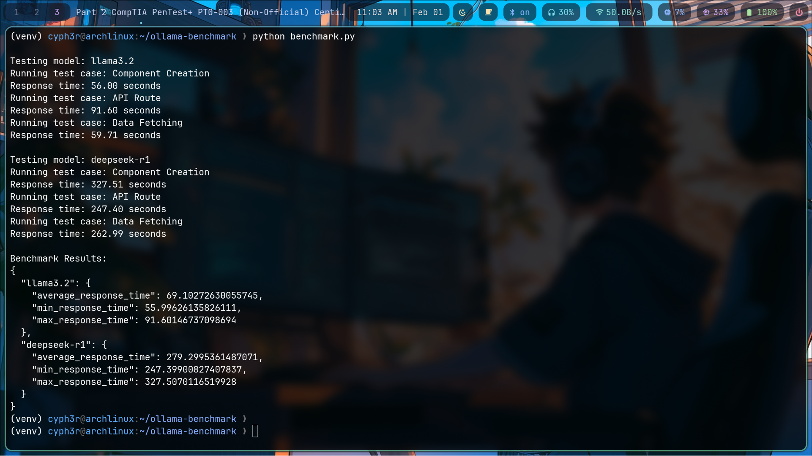

# Ollama Model Benchmark Tool

A Python-based benchmarking tool for comparing different Ollama models' performance in Next.js development tasks. This tool helps developers evaluate and choose the most efficient model for their coding assistance needs.



*Sample benchmark results comparing response times across different models*

## Features

- Benchmark multiple Ollama models simultaneously
- Measure response times and performance metrics
- Test models against real-world Next.js development scenarios
- Generate detailed performance reports
- Isolated testing environment using Python virtual environment

## Prerequisites

- Python 3.8 or higher
- Ollama installed and running locally
- At least one Ollama model pulled and ready to use

## Quick Start

1. Clone the repository:
```bash
git clone https://github.com/binoymanoj/ollama-benchmark
cd ollama-benchmark
```

2. Create and activate virtual environment:

Windows:
```bash
python -m venv venv
venv\Scripts\activate
```

Unix/MacOS:
```bash
python -m venv venv
source venv/bin/activate
```

3. Install dependencies:
```bash
pip install -r requirements.txt
```

4. Run the benchmark:
```bash
python benchmark.py
```

## Select Models to Compare
The benchmark tool provides an interactive terminal interface for selecting which models to test:

Navigation Controls:

↑ or k: Move cursor up
↓ or j: Move cursor down
SPACE: Toggle model selection
ENTER: Confirm selection and start benchmark


Selection Interface:

Select models using SPACE, navigate with UP/DOWN or j/k. Press ENTER when done.
```
[ ] llama2
[*] mistral
[ ] codellama
[*] neural-chat
```

[ ]: Unselected model
[*]: Selected model
Highlighted row: Current cursor position

> Note: You can select multiple models to benchmark them against each other in a single run. There is no limit to the number of models you can select, but testing more models will naturally take longer.

### Customizing Test Cases

Add or modify test cases in `benchmark.py`:

```python
test_cases = [
    {
        "name": "Custom Test",
        "prompt": "Your custom prompt here"
    }
]
```

## Test Cases

Default test cases cover common Next.js development scenarios:

1. Component Creation
   - Tests model's ability to generate responsive React components
   - Evaluates understanding of Next.js patterns

2. API Route Implementation
   - Tests knowledge of Next.js API routes
   - Evaluates authentication handling

3. Data Fetching
   - Tests understanding of Next.js data fetching methods
   - Evaluates server-side rendering knowledge

## Output Format

The benchmark generates a JSON report with:

```json
{
  "summary": {
    "model_name": {
      "average_response_time": float,
      "min_response_time": float,
      "max_response_time": float
    }
  },
  "detailed_results": {
    "model_name": {
      "response_times": [...],
      "responses": [...]
    }
  }
}
```

## Project Structure

```
ollama-benchmark/
├── LICENSE
├── README.md
├── benchmark.py
├── requirements.txt
├── screenshots/
└── venv/
```

## Contributing

1. Fork the repository
2. Create a feature branch: `git checkout -b feature/amazing-feature`
3. Commit changes: `git commit -m 'Add amazing feature'`
4. Push to branch: `git push origin feature/amazing-feature`
5. Open a Pull Request

## License

This project is licensed under the MIT License - see the [LICENSE](LICENSE) file for details.

## Acknowledgments

- Ollama team for providing the model serving infrastructure
- Next.js community for inspiration on test cases

## Support

If you encounter any issues or have questions:
1. Check existing GitHub issues
2. Create a new issue with detailed description
3. Include your system information and Ollama version

---

Made with ❤️ by Binoy Manoj
